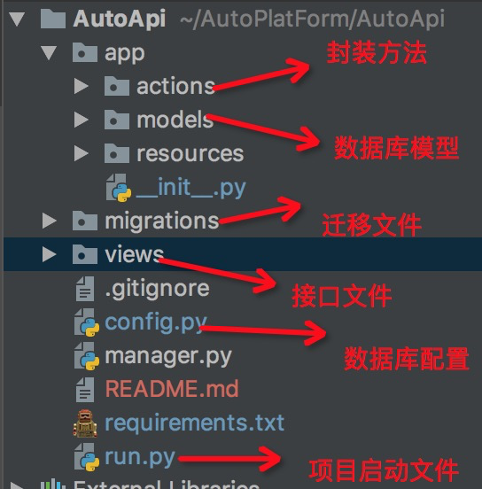

#项目结构：

#本项目基本python3

###安装包：pip3 install -r requirements.txt

### 装完robotframework-httplibrary
1.修改/site-packages/HttpLibrary下的__init__文件

2.注释掉import livetest

3.load_json方法中把except ValueError 修改成except ValueError as e:

5.第五行改为from urllib.parse import urlparse
###修改/site-packages/flask_sqlalchemy/__init__.py
1. 30行改为----from flask_sqlalchemy._compat import iteritems, itervalues, xrange, \
     string_types

     
